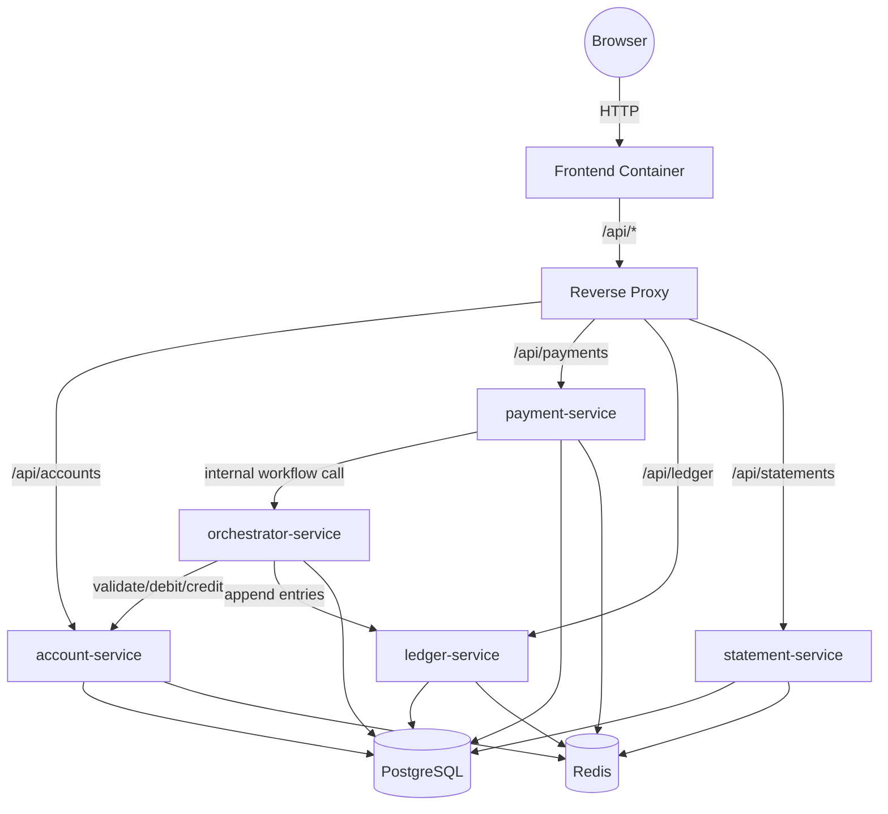

# SBCbank Local Routing Overview

This document describes the active Docker-first routing flow for local development.

---

## High-Level Routing Diagram

---

## Routing Pathways

### 1. Frontend Requests

- **Browser -> Frontend Container**
  - Frontend is served locally and uses proxy-backed `/api` paths.

### 2. API Requests

- **Browser -> Frontend -> Reverse Proxy -> Backend Service**
  - Proxy routes requests to account, payment, ledger, and statement services.

### 3. Orchestration Flow

- **Payment Service -> Orchestrator Service -> Account/Ledger Services**
  - Payment initiation delegates workflow execution to orchestrator.
  - Orchestrator coordinates account validation, debit/credit, and ledger write.
  - Payment service updates response based on orchestration result.

### 4. Database & Caching

- **All services -> PostgreSQL**
  - Shared relational store for domain and orchestration execution state.
- **Optional cache path -> Redis**
  - Redis remains available for cache/idempotency work.

---

## Service Endpoints (Local)

- account-service: `http://localhost:8001`
- payment-service: `http://localhost:8002`
- ledger-service: `http://localhost:8003`
- statement-service: `http://localhost:8004`
- orchestrator-service: `http://localhost:8005`

---

For detailed implementation sequencing, see `docker-first-implementation-plan.md`.
