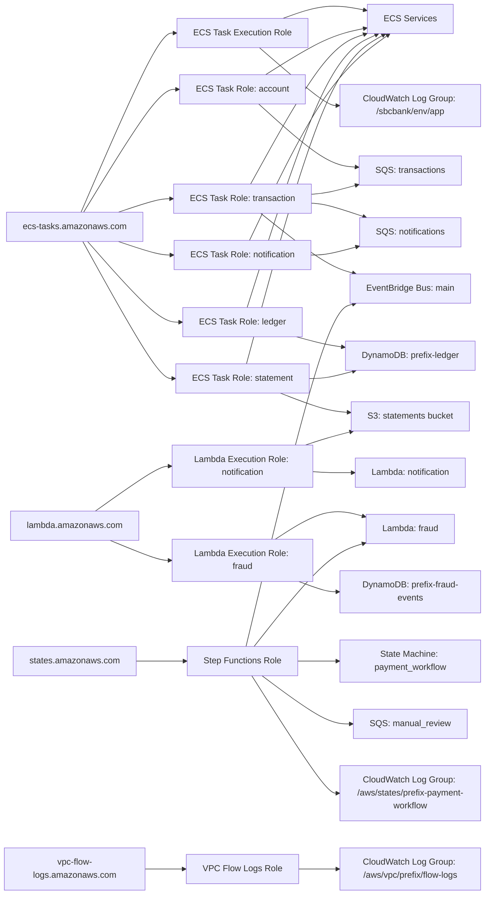

# SBCbank IAM Diagram

This diagram reflects the IAM roles, trust relationships, and primary permission paths currently defined in Terraform.

## Source Mapping

- IAM roles and policies are defined in [terraform/main.tf](terraform/main.tf).
- Role outputs are exposed in [terraform/outputs.tf](terraform/outputs.tf).
